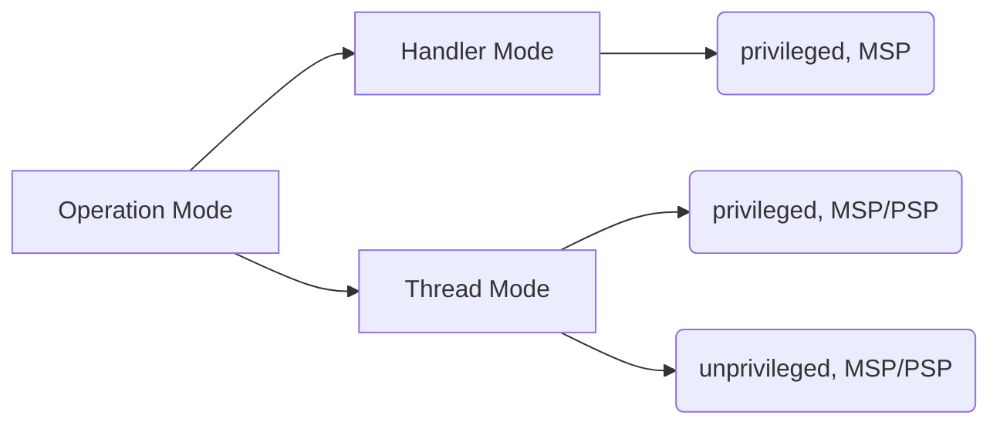

## Operation modes
- Handler mode: 中断或异常执行过程，就是Handler mode
- Thread mode: 非中断或异常执行过程。

## Privileged level
> 通过特色功能寄存器CONTROL中的nPRIV位选择
- privileged: 可以访问MCU的所有资源，一般OS kernel就在privileged lever运行
- unprivileged：特殊寄存器及一些其他资源不能访问，一般application或者不受信任的代码就在unprivileged level运行

## Stack Pointer
> 通过特色功能寄存器CONTROL中的SPSEL位选择
- MSP：Main SP
- PSP：Process SP

> 以上各个状态的转换：
> 
> Thread_privileged --> Thread_unprivileged
> 
> Thread_unprivileged --> Handler_privileged --> Thread_privileged
> 
> Handler_privileged --> Thread_privileged

